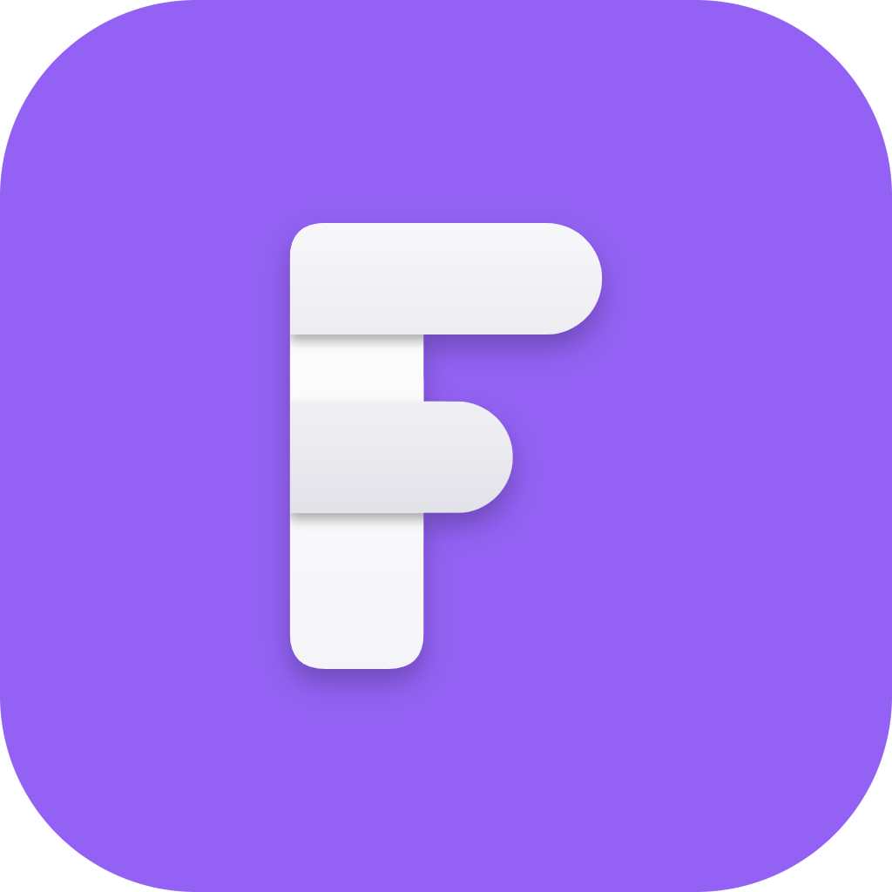
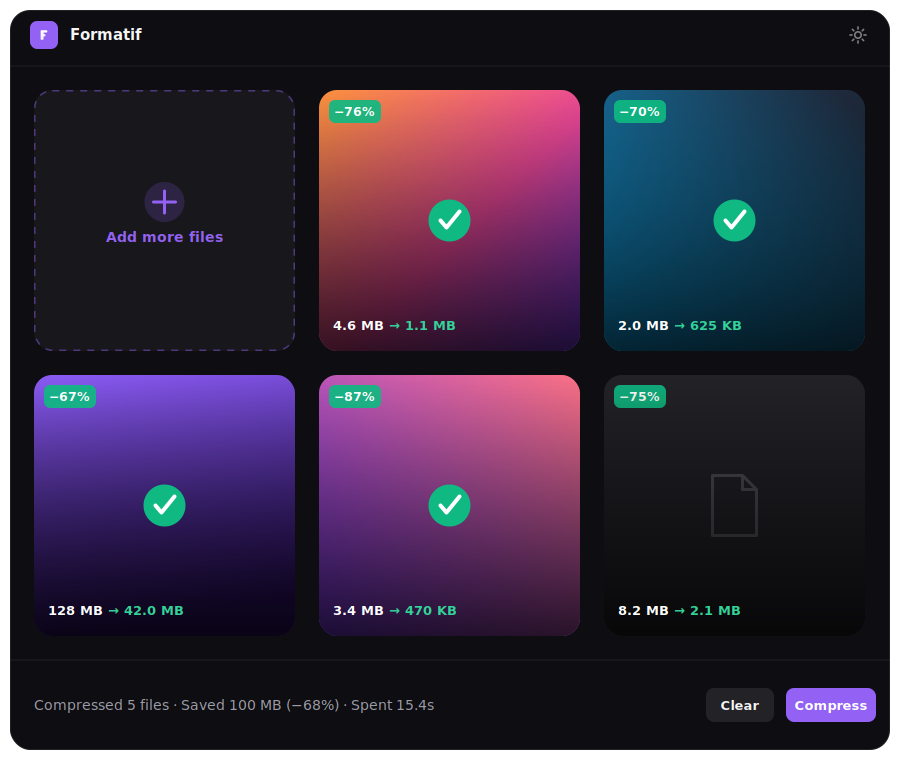

<div align="center">


# Formatif

**Compress images, video, GIFs and PDFs — free, open source, 100% local.**

No uploads. No account. No subscription. Everything runs on your own machine.

[](https://github.com/aeroray/Formatif/releases/latest)
[](https://github.com/aeroray/Formatif/releases/latest)
[](LICENSE)
[](https://github.com/aeroray/Formatif/releases/latest)
[](https://tauri.app)

[English](README.md) · [简体中文](README.zh-CN.md)

### [⬇ Download the latest release](https://github.com/aeroray/Formatif/releases/latest)


</div>

## Contents

- [Features](#features)
- [Installing on macOS](#installing-on-macos)
- [Tech stack](#tech-stack)
- [How compression works](#how-compression-works)
- [Bundled tools](#bundled-tools)
- [Getting started](#getting-started)
- [Project structure](#project-structure)
- [Roadmap](#roadmap)
- [License](#license)

## Features

- **Free & open source (MIT)** — no license key, no paywall, no telemetry.
- **Everything included** — ffmpeg, qpdf and gifsicle are bundled in the installer; nothing downloads on first run.
- **Private by design** — files never leave your machine.
- **Batch** — drop files *or whole folders*; compress them all in parallel.
- **Folder monitoring** — watch folders and auto-compress anything dropped into them.
- **Presets** — a read-only default preset plus your own named presets, with per-file overrides for one-off exceptions.
- **Before/after compare** — see size and quality side by side for images, video, GIF and PDF.
- **Dark, focused UI** with 7 accent colors, bilingual (English & 简体中文, auto-selected from your system language).

## Installing on macOS

The macOS build isn't code-signed yet (no Apple Developer certificate), so macOS quarantines it after download and blocks the first launch with something like *"Formatif can't be opened because it is from an unidentified developer."* After moving `Formatif.app` into `/Applications`, either:

- Right-click (or Control-click) `Formatif.app` → **Open** → confirm **Open** in the dialog, **or**
- Run this once in Terminal:

  ```sh
  xattr -rd com.apple.quarantine /Applications/Formatif.app
  ```

## Tech stack

- **Tauri 2** (Rust) shell + **React 19 + TypeScript + Vite** frontend
- **shadcn/ui** (Tailwind v4, Radix) + **zustand**
- External CLI tools, **bundled in the installer**: **ffmpeg** (image/video/gif), **qpdf** (PDF structure), **gifsicle** (GIF lossy optimization).

## How compression works

Each file belongs to a category — **Image**, **Video**, **GIF** or **PDF** — with its own settings:

| Setting        | Options                                                                                                     |
| -------------- | ------------------------------------------------------------------------------------------------------------ |
| Quality        | Original · Balanced · High · Medium · Low                                                                    |
| Resolution     | 100% · 75% · 50% · 25%                                                                                       |
| Format (Image) | Original · JPEG · PNG · WebP · AVIF · ICO                                                                    |
| Format (Video) | Original · MP4 · WebM · MOV · MKV · AVI · WMV · FLV · M4V · 3GP · GIF · MP3 · AAC · WAV · FLAC · OGG · M4A   |
| Format (GIF)   | Original · MP4 · WebM · WebP                                                                                 |
| PDF            | Always stays a PDF                                                                                           |

- **Image / video** — the Rust backend builds ffmpeg arguments per (category × format × quality) in [`args.rs`](src-tauri/src/args.rs). Progress, cancel and results stream back over `compress://*` events.
- **GIF** — ffmpeg rebuilds the palette (frame rate + colors driven by the quality preset), then **gifsicle** applies lossy compression on top — ffmpeg alone can't shrink an already-optimized GIF, gifsicle is what actually gets the size down.
- **PDF** — losslessly recompressed with **qpdf**. For image-heavy PDFs, an optional rasterize-and-rebuild pass (pdf.js + pdf-lib, in the webview) can downsample embedded images further; it's only kept if the result is smaller than the original.
- Broader **input** support beyond the output formats above: HEIC/HEIF, PSD, SVG, TIFF, BMP, TGA and JPEG-2000 images decode to PNG before compressing; common legacy video containers (MPG, TS, M2TS, 3G2, OGV) are also accepted.

## Bundled tools

ffmpeg, qpdf and gifsicle ship inside the installer — nothing is downloaded at runtime:

- **ffmpeg** — gyan.dev release-essentials on Windows (image/video/gif/audio)
- **qpdf** — official release on Windows; Homebrew bottle on macOS
- **gifsicle** — eternallybored build on Windows; Homebrew bottle on macOS (GIF lossy optimization)

They're staged into `src-tauri/tools-staging/` at build time — see [`scripts/stage-tools-windows.ps1`](scripts/stage-tools-windows.ps1) / [`scripts/stage-tools-macos.sh`](scripts/stage-tools-macos.sh) — and installed next to the app executable. A small transient `cache/` folder (also next to the executable) is used for decode/rasterize scratch work and is wiped on every launch and exit. During development the ffmpeg on your `PATH` is used instead of a staged copy; override any tool with `FORMATIF_<TOOL>` (e.g. `FORMATIF_FFMPEG`).

> ffmpeg's "essentials" build and gifsicle are GPL-licensed; qpdf is Apache-2.0. They're bundled as separate executables invoked as subprocesses (not linked into Formatif's own code), which is the "mere aggregation" GPL explicitly allows — but the installer does contain GPL-licensed binaries. Formatif's own code stays [MIT](LICENSE); the bundled tools remain under their own licenses.

## Getting started

### Prerequisites

- [mise](https://mise.jdx.dev) (provisions Node, pnpm and a dev FFmpeg), or Node 26 + pnpm 11 manually.
- A Rust toolchain (`rustup`, stable).
- Windows with WebView2 (preinstalled on Windows 11).

### Setup & development

```sh
mise trust && mise install   # Node, pnpm, FFmpeg (dev)
pnpm install

pnpm tauri dev      # launch the desktop app (Rust + webview)
pnpm dev            # frontend only, in a browser (mock mode — no compression)
pnpm build          # type-check + build the frontend
cargo test --manifest-path src-tauri/Cargo.toml   # backend tests
```

### Building for release

```sh
pnpm tauri build
```

Output → `src-tauri/target/release/bundle/nsis/Formatif_<version>_x64-setup.exe` (~34 MB, with ffmpeg/qpdf/gifsicle bundled — `mise run build` stages them first automatically).

## Project structure

```
src/
  screens/                Main · Settings
  components/
    file-grid/            dropzone, thumbnail cards, run summary
    sidebar/               preset header, output card, per-type settings
    compression/           shared CompressionControls (sidebar + per-file)
    file-panel/             per-file override drawer
    settings/               settings nav + panels
  hooks/                   drag & drop, file ingest, compression run loop
  store/store.ts           zustand: useSettingsStore (persisted) + useAppStore
  lib/compress.ts          category/format metadata + helpers
  lib/pdf.ts               pdf.js render + pdf-lib rasterize/rebuild
  lib/decode.ts            HEIC/PSD/SVG → PNG decode (webview-side)
  lib/tauri.ts             command + event wrappers
src-tauri/src/
  tools.rs                 resolves bundled tool paths (ffmpeg, qpdf, gifsicle)
  args.rs                  ffmpeg arg builder per category × format × quality
  commands.rs              compress pipeline, thumbnails, file expansion
  ffmpeg.rs                transcode core (progress + cancel)
  watcher.rs               folder monitoring (auto-compress on change)
  state.rs                 job registry, cancellation, concurrency
```

## Roadmap

- Specialized optimizers (oxipng).
- HEIC/HEIF input, "Target size" mode, clipboard output, jobs history.
- Code-signed & notarized macOS build; Intel Mac support.

## License

[MIT](LICENSE) — Formatif's own code. Bundled third-party tools (ffmpeg, gifsicle, qpdf) remain under their own licenses; see [Bundled tools](#bundled-tools).
